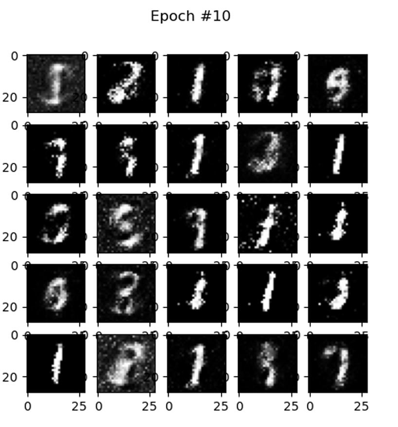
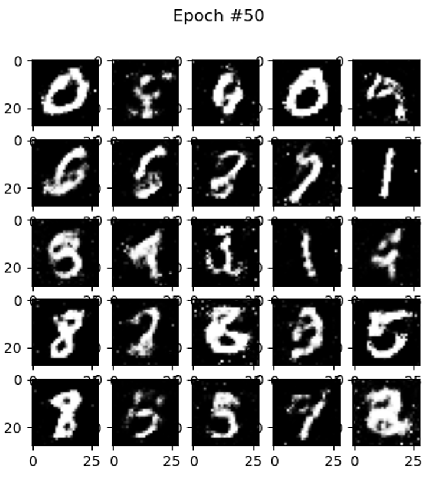
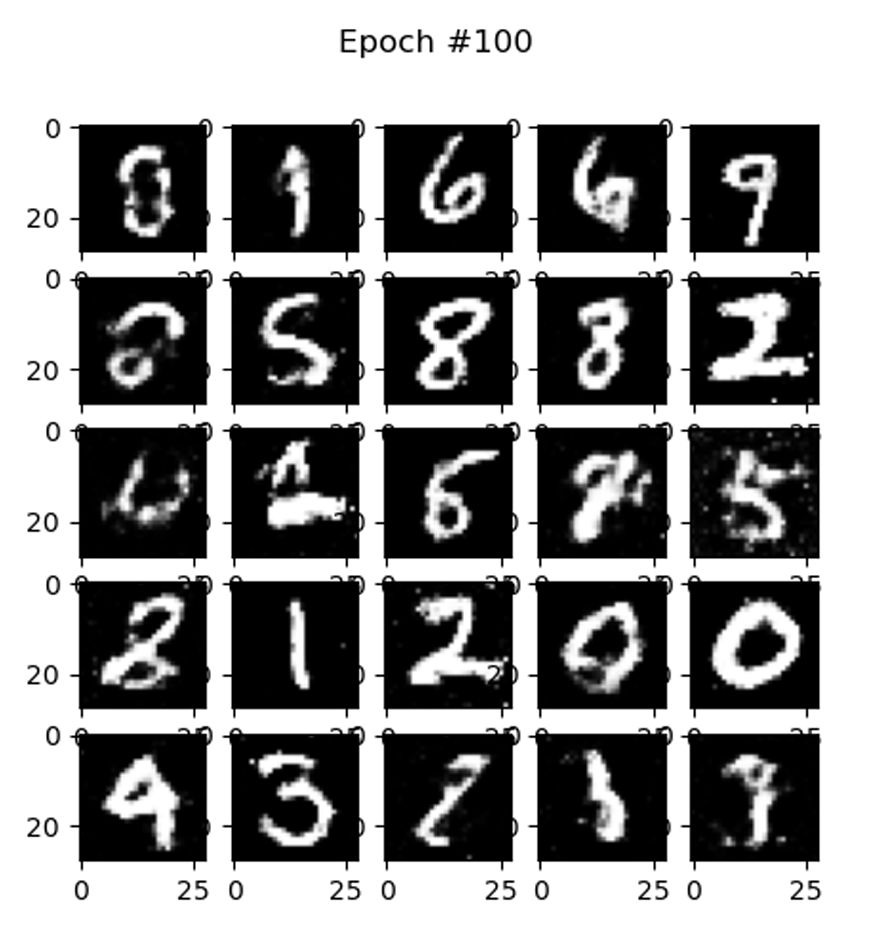

# MNIST GAN - Unsupervised Learning with Generative Adversarial Networks

This repository contains an implementation of a **Generative Adversarial Network (GAN)** trained on the **MNIST dataset** for generating realistic handwritten digits. The project is a coursework submission for *ECS795P Deep Learning and Computer Vision, 2023*.

## 📂 Project Structure
```
MNIST_GAN/
├── data_loader.py       # Handles dataset loading
├── models.py            # Defines Generator & Discriminator
├── train.py             # Training loop implementation
├── utils.py             # Utility functions (visualization, noise generation)
├── gan.py               # Main entry point
├── report.pdf           # Coursework report
├── requirements.txt     # Dependencies
├── README.md            # Documentation
└── MNIST_GAN_results/   # Stores generated images and logs
```

## 📌 Project Overview
This project explores **unsupervised learning using GANs**, comparing **GANs vs. Autoencoders**, experimenting with **hyperparameters (learning rate, batch size, dropout)**, and evaluating **training stability**.

### 🛠 Model Architecture
#### **Generator:**
- Fully connected layers with **LeakyReLU** activation
- Uses **Tanh activation** in the output layer to generate normalized images

#### **Discriminator:**
- Fully connected layers with **LeakyReLU activation**
- Outputs a **probability (Sigmoid activation)** indicating real vs. fake images

## 🚀 Setup and Installation
### **1️⃣ Clone this repository:**
```sh
git clone https://github.com/Abhi5ingh/MNIST-GAN.git
cd MNIST-GAN
```
### **2️⃣ Install dependencies:**
```sh
pip install -r requirements.txt
```
*(If `requirements.txt` is missing, install manually:)*
```sh
pip install torch torchvision numpy matplotlib tqdm
```

## 📊 Training the GAN
Run the script to train the GAN on MNIST:
```sh
python train.py
```

## 🔍 Experimental Findings
- **Effect of learning rate (0.01):** The generator failed to learn meaningful representations.
- **Effect of batch size (256 vs. 100):** Larger batch sizes led to faster training but potential **mode collapse**.
- **Effect of dropout removal:** Discriminator overfitting led to poor-quality generations.
- **Wasserstein Distance for Stability:** Used to improve training convergence by providing smoother gradients.

## 📸 Example Generated Images
Generated digits at **different epochs**:
| 10th Epoch | 50th Epoch | 100th Epoch |
|------------|-----------|------------|
|  |  |  |

## 📜 License
This project is open-source and available under the **MIT License**.

## 🤝 Contributing
Feel free to fork this repo and improve the model! Pull requests are welcome.

## 📧 Contact
For questions or collaboration, reach out to:
- **GitHub**: [Abhi5ingh](https://github.com/Abhi5ingh)
- **Email**: abhisteak@gmail.com
