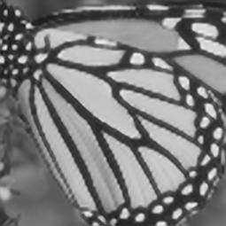

# Super-Resolution using SRCNN

This repository contains an implementation of a **Super-Resolution Convolutional Neural Network (SRCNN)** for image upscaling. The model is trained to enhance low-resolution images by increasing their quality and restoring finer details.

## 📂 Project Structure
```
Super-Resolution-SRCNN/
│── image/               # Folder for input images
│── model/               # Folder containing the trained model
│   ├── model.pth        # Pre-trained SRCNN model
│── srcnn.py             # Python script for running the SRCNN model
│── Ground_truth.jpg     # High-resolution reference image
│── HR_img.jpg           # High-resolution processed image
│── LR_img.jpg           # Low-resolution input image
│── Report.pdf       # Project report 
│── README.md            # This file
```

## 🚀 Installation
1. **Clone this repository**
   ```sh
   git clone https://github.com/<your-username>/Super-Resolution-SRCNN.git
   cd Super-Resolution-SRCNN
   ```

2. **Install dependencies**

   ```sh
   pip install torch torchvision numpy opencv-python
   ```

## 📌 Usage
### **Run Super-Resolution on an Image**
1. Place your **low-resolution image** inside the `image/` folder.
2. Run the script:
   ```sh
   python srcnn.py --input image/LR_img.jpg --output image/HR_img.jpg
   ```
   
   - `--input` → Path to the low-resolution image.
   - `--output` → Path to save the high-resolution output.

### **Example Command**
```sh
python srcnn.py --input image/sample_lowres.jpg --output image/output_highres.jpg
```

## 🔧 Model Details
- The SRCNN model consists of **three convolutional layers** to learn a mapping from low-resolution to high-resolution images.
- Trained using **Mean Squared Error (MSE) loss** and **Adam optimizer**.
- Uses **PyTorch** for implementation.

## 📝 Notes
- If `model.pth` is missing, you can download it from **[Google Drive](#)** (update this link with your actual model location).
- The model works best on **natural images**, but performance may vary depending on training data.

## 📌 Example Images
| Low-Resolution (Input) | High-Resolution (Output) |
|------------------------|-------------------------|
|  |  |

## 📜 License
This project is open-source and available under the **MIT License**.

## 🤝 Contributing
Feel free to fork this repo and improve the model! Pull requests are welcome.

## 📧 Contact
For questions or collaboration, reach out to:
- **GitHub**: [Abhi5ingh](https://github.com/Abhi5ingh)
- **Email**: abhisteak@gmail.com
